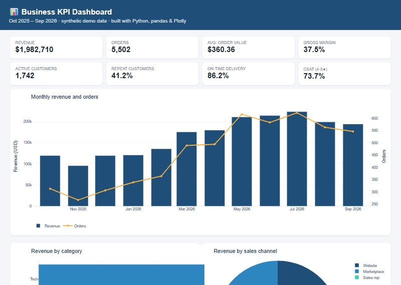

# Business KPI Dashboard


Dashboard for sales, customers and operational KPIs.

**▶ Live demo:** https://gabrielvalle-491.github.io/business-kpi-dashboard/



## The business problem

The owner of a growing distribution business gets numbers from three places —
order exports, the customer list and the support inbox — and spends every Monday
building the same spreadsheet by hand. Nobody sees in time that deliveries are
getting late or which region is driving growth.

## What it shows

| Area | KPIs |
|------|------|
| **Sales** | Revenue, orders, average order value, gross margin %, month-over-month growth, revenue by category / region / channel, top products |
| **Customers** | Active customers, repeat-customer rate |
| **Operations** | On-time delivery % vs. a 90% target, return rate |
| **Support** | Tickets by topic, average resolution time, CSAT (% of 4-5 star ratings) |

Two ways to use it:

1. **Interactive app** (Streamlit) with filters by date range, region and channel.
2. **Static HTML report** (`docs/index.html`) generated with one command and published
   with GitHub Pages — easy to email or share with someone who doesn't use Python.

Business rules are explicit and tested: revenue only counts *delivered* orders
(returns and cancellations excluded), on-time = delivered within the promised days.

## Quick start

```bash
pip install -r requirements.txt

python -m dashboard.generate_data data          # 12 months of demo data
streamlit run app.py                            # interactive dashboard
python -m dashboard.build_static data docs/index.html   # shareable HTML report
```

Replace the CSV files in `data/` with real exports (same columns) and the
dashboard works on real data.

## Demo dataset (synthetic)

`generate_data.py` simulates a realistic small business: ~5,500 orders over 12 months
with growth, seasonality and weekend dips, a long-tail customer base (a few loyal
buyers, many one-time buyers), 5 regions, 3 channels, returns/cancellations, delivery
delays and 1,500 support tickets.

| KPI (full year) | Value |
|---|---:|
| Revenue | $1,982,710 |
| Orders | 5,502 |
| Avg. order value | $360.36 |
| Gross margin | 37.5% |
| Repeat customers | 41.2% |
| On-time delivery | 86.2% |
| CSAT | 73.7% |

## Project structure

```
app.py                    # Streamlit app
dashboard/
├── kpis.py               # all KPI logic (pure pandas, unit tested)
├── charts.py             # Plotly figures shared by app + static report
├── build_static.py       # HTML report for GitHub Pages
└── generate_data.py      # realistic demo data
data/                     # orders.csv, customers.csv, tickets.csv
docs/                     # published static dashboard
tests/
```

## Tests

```bash
pytest -q
```

## Notes

- All data is synthetic. No real company data.
- Built with Python (pandas, Plotly, Streamlit) and [Claude Code](https://claude.com/claude-code) as an AI pair programmer.

## Author

**Gabriel Valle** — Data & AI automation (Excel, PDF, workflows) · Villa Mercedes, Argentina · Remote
